---
# 🚀 오자작 (OZAZAK) — 개인 맞춤형 AI 자소서 생성기

> 취업 준비생의 경험과 채용 공고를 AI가 분석하여 **개인 맞춤형 자기소개서**를 생성하는 플랫폼

📅 **개발 기간**: 2026.01.12 ~ 2026.02.09 (6인 팀)

---

## 📌 프로젝트 개요

오자작은 사용자가 자신의 **경험 블록**(TIL, 프로젝트)을 등록하면, AI가 채용 공고를 분석하고 관련성 높은 경험을 자동 매칭하여 **맞춤형 자소서**를 생성해주는 서비스입니다.

### 배경
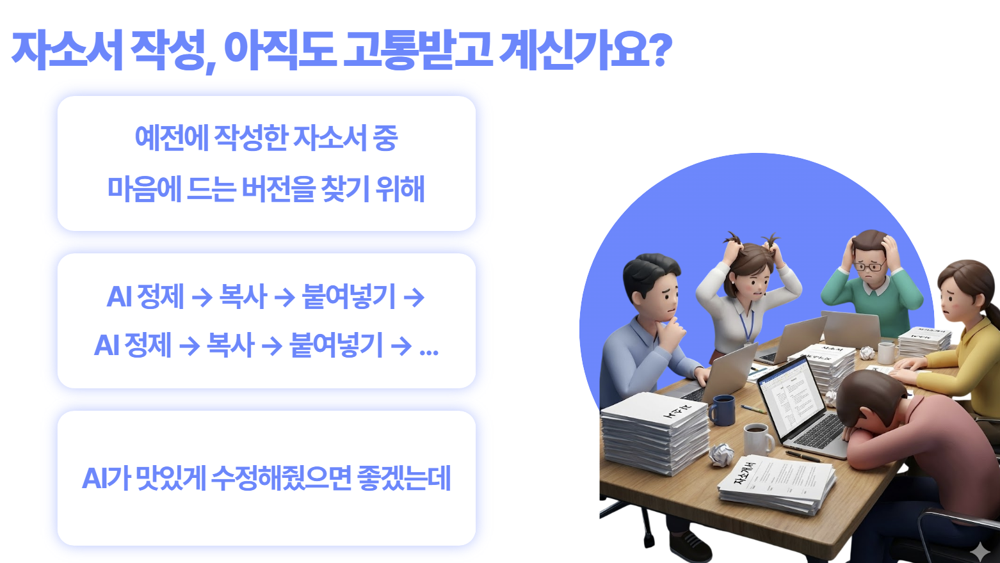


### 유저 시나리오
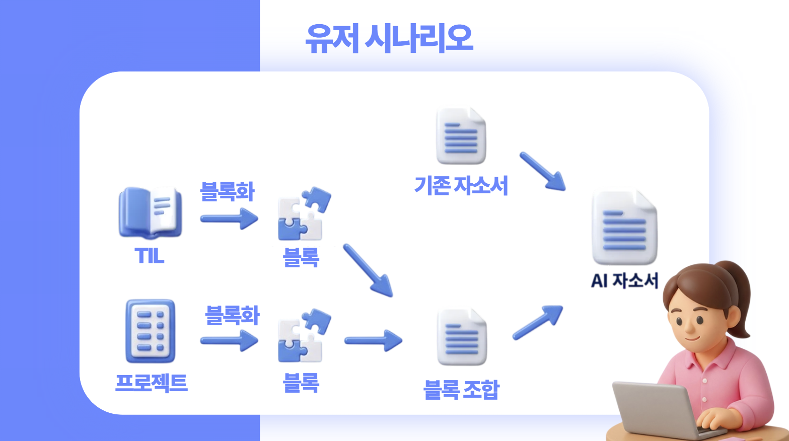

---

## 🛠 기술 스택

### Backend

| 기술 | 선택 이유 |
|---|---|
| **Spring Boot 3.2** (Java 17) | 헥사고날 아키텍처 적용에 적합한 엔터프라이즈 프레임워크 |
| **Gradle 멀티모듈** | domain/application/infra/presentation 계층 분리하여 의존성 역전 강제 |
| **PostgreSQL 15 + pgvector** | 벡터 검색 지원이 필요하여 pgvector 확장 사용 |
| **Redis 7** | 세션 캐싱 + AI 분석 결과 캐싱 (동적 TTL) |
| **Spring Security + JWT** | 토큰 기반 인증, Stateless 서버 구현 |
| **Flyway** | DB 스키마 버전 관리 (37개 마이그레이션) |

### AI Service

| 기술 | 선택 이유 |
|---|---|
| **FastAPI** (Python 3.11) | 비동기 처리 + SSE 스트리밍에 최적화 |
| **LangChain + LangGraph** | 복잡한 자소서 생성 파이프라인을 DAG로 구성하여 병렬 문항 처리 |
| **FAISS + OpenAI Embeddings** | 경험 블록 벡터 검색으로 관련성 높은 소재 자동 추출 |
| **Redis** | 채용 공고 분석 결과 캐싱 (마감일 기반 동적 TTL) |
| **LangSmith** | LLM 호출 추적·디버깅 |

### Infra

| 기술                 | 선택 이유                                          |
| ------------------ | ---------------------------------------------- |
| **Docker Compose** | 5개 서비스(Nginx, Back, AI, Postgres, Redis) 일괄 관리 |
| **Nginx**          | HTTPS 리버스 프록시 + SSE 스트리밍 최적화 + SPA 라우팅         |
| **Jenkins**        | Git Webhook 기반 자동 배포 (CD 파이프라인)                |

---

## ✨ 주요 기능

| 기능               | 설명                                          |
| ---------------- | ------------------------------------------- |
| 🤖 **AI 자소서 생성** | 경험 블록 + 채용 공고 → LangGraph 파이프라인으로 맞춤 자소서 생성 |
| ✏️ **AI 자소서 수정** | 피드백 입력 → AI가 글자 수 검증하며 자동 수정 (최대 3회 재생성)    |
| 📦 **경험 블록 관리**  | TIL, 프로젝트, 자소서에서 경험 블록 추출 + 임베딩 (온디멘드)      |
| 📋 **자소서 버전 관리** | 하나의 자소서에 문항별 버전 관리                          |
| 🏢 **채용 공고 분석**  | 공고 URL 스크래핑 + Serper 기업 정보 검색 → 직무 분석 자동 생성 |
| 👤 **프로필 관리**    | 이력/수상/자격증 CRUD, 스트릭(활동 연속 기록)               |
| 💬 **커뮤니티**      | TIL, 프로젝트, 일반적인 커뮤니티 총 3개의 커뮤니티 성격의 기능      |

### TIL
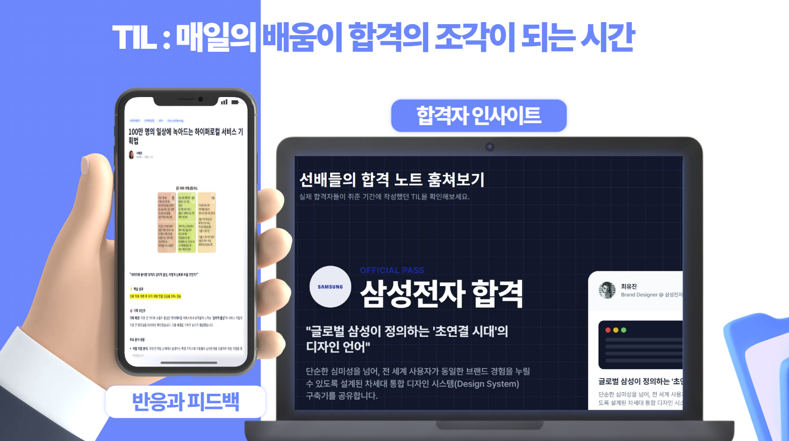

### 경험 블록 관리
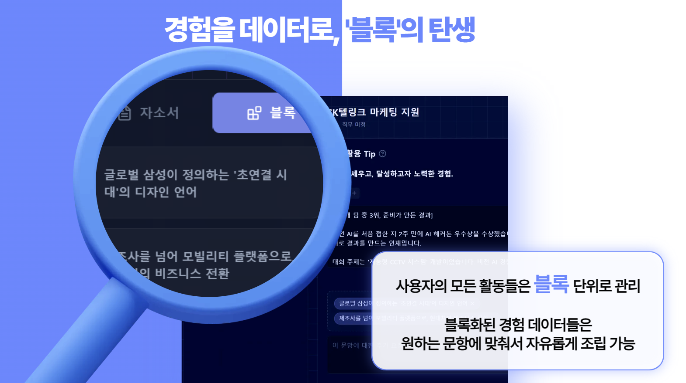

### AI 자소서 생성
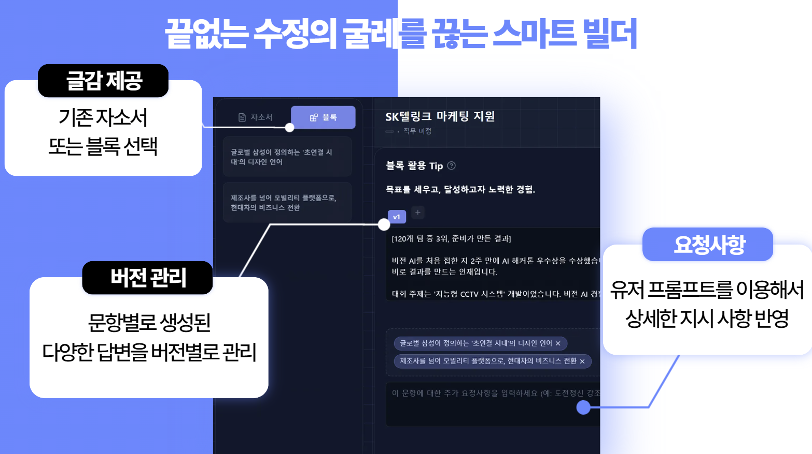

#### AI 기업 공고 분석
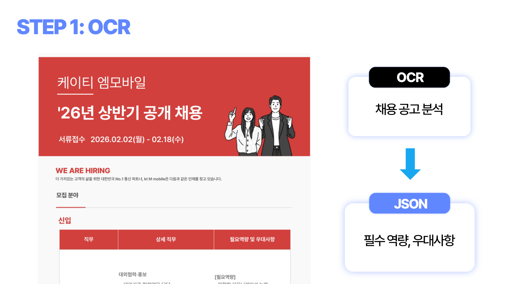

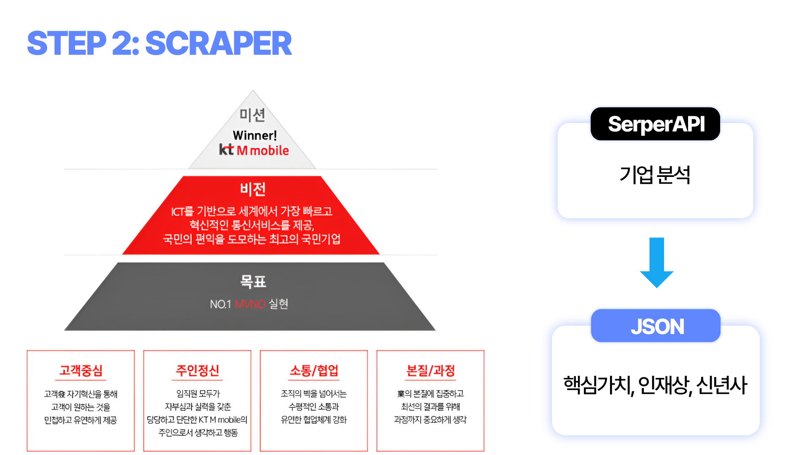

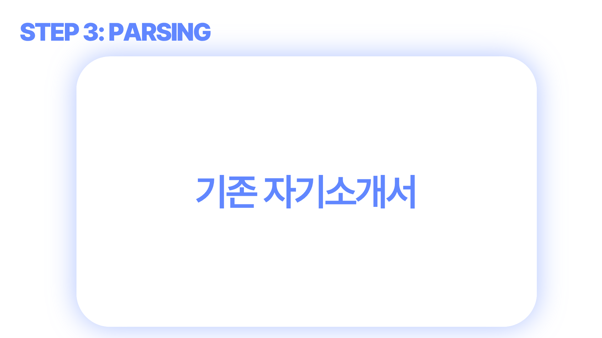

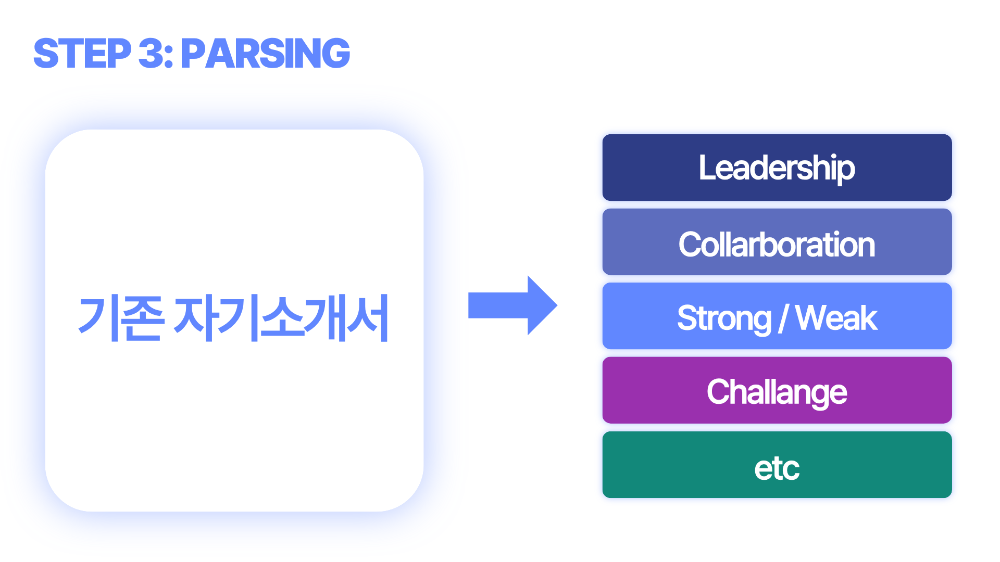

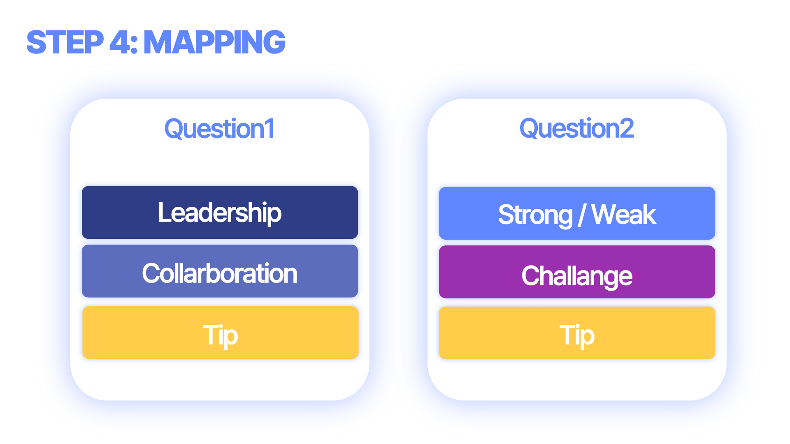

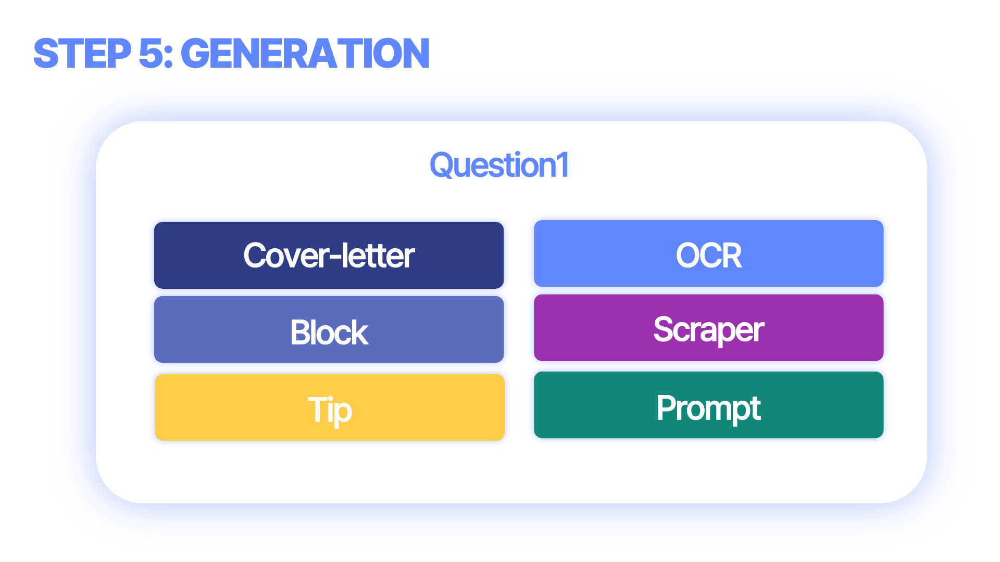

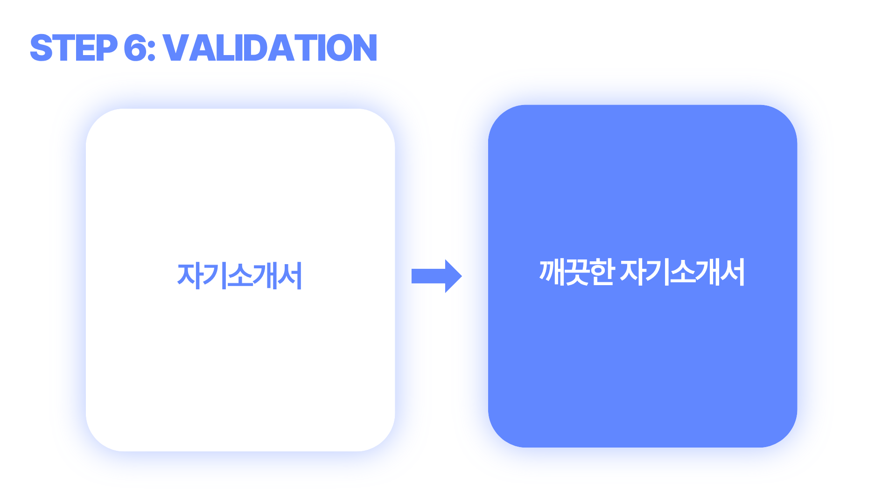


---

## 🏛 아키텍처

### 시스템 구조도
```
                    ┌─────────────────────────────────────────┐
                    │            Client (React)               │
                    └─────────────────┬───────────────────────┘
                                      │
                                      ▼ :80 / :443
                    ┌─────────────────────────────────────────┐
                    │         Nginx (Reverse Proxy)           │
                    │   HTTP → HTTPS 리다이렉트                │
                    │   /api/ai/*  ──►  AI Service            │
                    │   /api/*     ──►  Spring Backend        │
                    │   /*         ──►  React SPA             │
                    └─────────────────┬───────────────────────┘
                                      │
               ┌──────────────────────┼─────────────────────┐
               │                      │                     │
               ▼ :8000                ▼ :8080               │
    ┌──────────────────┐    ┌──────────────────┐            │
    │   AI Service     │    │  Spring Backend  │            │
    │   (FastAPI)      │    │  (Spring Boot)   │            │
    │                  │    │                  │            │
    │  LangGraph       │    │  헥사고날 아키텍처 │            │
    │  Pipeline        │    │  50 UseCases     │            │
    │  FAISS RAG       │    │  48 Controllers  │            │
    └──────────────────┘    └────────┬─────────┘            │
                                     │                      │
               ┌─────────────────────┼──────────────────────┘
               │                     │
               ▼ :5432               ▼ :6379
    ┌──────────────────┐    ┌──────────────────┐    ┌──────────────────┐
    │   PostgreSQL 15  │    │    Redis 7       │    │  Jenkins (CD)    │
    │   + pgvector     │    │   (캐시/세션)     │    │   자동 배포       │
    └──────────────────┘    └──────────────────┘    └──────────────────┘
```
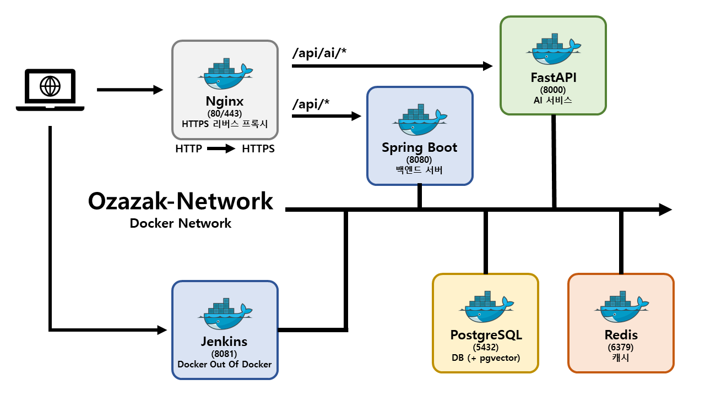

### 인프라 구조도
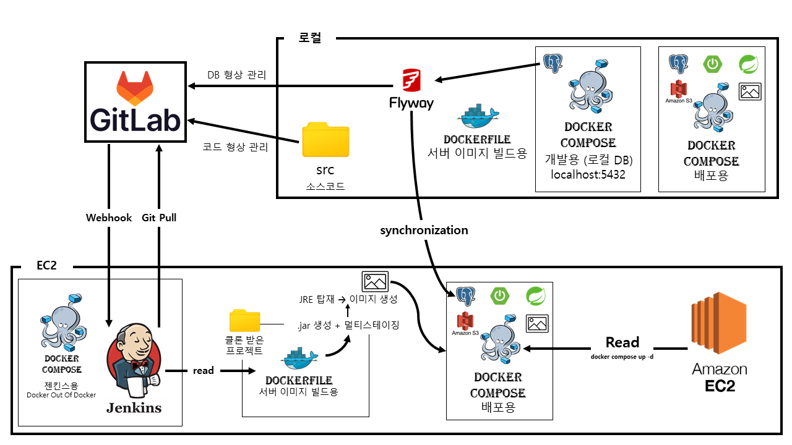


### 백엔드 모듈 의존성 (헥사고날)

```
presentation → application + infra + domain
application  → domain (순수 비즈니스 로직만)
infra        → application + domain (포트 구현체)
domain       → (의존성 없음, 순수 Java)
```

### AI 처리 흐름 (LangGraph Pipeline)

```
👤 사용자 요청
      │
      ▼
📥 데이터 로딩 (블록 + 자소서)
      │
      ▼
🔍 Enhanced 분석 (공고 스크래핑 + 기업 검색)
      │
      ├── Smart 모드: AI가 소재 자동 선택 (RAG + Reasoning)
      ├── Selected 모드: 사용자 선택 블록으로 생성
      └── Refine 모드: 피드백 반영 수정
              │
              ▼
🧠 LangGraph 병렬 생성 (Semaphore 2)
      │
      ▼
✅ 글자수 검증 → ❌ 실패 시 자동 재생성 (최대 3회)
      │
      ▼
💾 저장 + SSE 실시간 전달
```

---

## 🔥 핵심 트러블슈팅

### 1. Nginx 502 Gateway Error — Docker 네트워크 격리 문제

> **문제**: Docker Compose로 전체 서비스 기동 후, Nginx가 백엔드/AI 서비스로 프록시할 때 **502 Bad Gateway** 발생. 각 컨테이너는 정상 실행 중.

> **원인**: 프로덕션 환경에서 Jenkins(`docker-compose-jenkins.yml`), 백엔드(`docker-compose-prod.yml`)가 **별도의 Docker Compose 파일**로 실행되면서 각각 독립된 네트워크에 속함. Nginx의 `upstream`에서 컨테이너명 DNS resolve 불가.

> **해결**: `docker network create ozazak-network`로 **외부 공유 네트워크**를 생성하고, 모든 Compose 파일에서 `networks: ozazak-network: external: true`로 통일. 컨테이너 간 DNS 기반 통신 정상 동작 확인.

### 2. AI 서비스 연결 실패 — 내부 통신 프로토콜 불일치

> **문제**: 프로덕션 배포 후, 백엔드에서 AI 서비스 호출 시 **Connection Refused** 발생.

> **원인**: `FASTAPI_URL`이 `https://ozazak-ai-prod:8000`으로 설정됨. Docker 내부 통신은 Nginx를 거치지 않으므로 **SSL 미적용 상태**이고, FastAPI는 HTTP로만 listen 중.

> **해결**: 내부 통신 URL을 `http://ozazak-ai-prod:8000`으로 수정. **외부 트래픽 → Nginx(HTTPS)**, **내부 컨테이너 간 → HTTP** 원칙 확립.

### 3. 백엔드 무한 재시작 — DB 스키마 불일치 (Flyway + JPA)

> **문제**: `docker ps` 시 백엔드 컨테이너가 **Restarting** 상태를 반복하며 정상 기동되지 않음.

> **원인**: JPA Entity에 `created_at` 컬럼이 정의되어 있으나, Flyway 마이그레이션 SQL에는 해당 컬럼이 누락됨. Spring Boot 기동 시 `Schema-validation` 에러가 발생하여 애플리케이션이 즉시 종료됨.

> **해결**: Flyway SQL 파일에 `created_at` 컬럼을 추가하고, 기존 데이터 충돌 방지를 위해 볼륨 삭제 후 재배포.

```bash
docker compose -f docker-compose-prod.yml down -v
docker compose -f docker-compose-prod.yml up -d --build
```

### 4. Jenkins 컨테이너 자살 — Docker Compose 서비스 격리

> **문제**: 젠킨스 파이프라인을 통해 배포를 진행하면, `docker-compose up` 과정에서 **Jenkins 컨테이너 자체가 종료**되어 빌드와 배포가 중단됨.

> **원인**: **DooD 패턴**의 특성상 젠킨스는 호스트의 도커 엔진을 공유함. 그런데 배포 스크립트가 실행되는 `docker-compose-prod.yml` 안에 젠킨스 서비스 설정이 포함되어 있거나, 전체 서비스를 재시작하는 명령을 내리면, 호스트 도커 엔진은 **"명령을 내린 주체인 젠킨스 컨테이너"까지 새 버전으로 교체하려고 시도**하면서 연결이 끊겨버리는 현상.

> **해결**: **DooD 구조의 이점**을 살려, 젠킨스를 관리하는 설정파일(`docker-compose-jenkins.yml`)과 실제 서비스들을 관리하는 설정파일(`docker-compose-prod.yml`)을 **완전 분리**.
> 
> - **젠킨스:** 한 번 띄워두면 서비스 배포와 상관없이 독립적으로 살아있음.
> - **서비스:** 젠킨스가 호스트의 도커 엔진에 명령을 내려 서비스 컨테이너들만 골라서 껐다 켰다(Recreate) 함.
> - **결과:** 배포 도중 젠킨스가 꺼지지 않고 안정적으로 파이프라인을 완수할 수 있는 구조 확보.


### 5. 메모리 부족 서비스 종료 — OOM Killer
> **문제**: 빌드 및 컨테이너 교체 시 `Exited (143)` 발생하며 서비스 다운. Nginx에서 **502 Bad Gateway** 노출.

> **원인**: EC2 환경에서 Jenkins 빌드 + Spring Boot + AI 서비스가 동시에 가동될 때 **OOM Killer**가 프로세스를 강제 종료.

> **해결**:

1. EC2 호스트에 **2GB 스왑 메모리** 설정으로 물리 메모리 한계 보완.
2. `docker-compose up` 시 `--no-build` 옵션으로 빌드와 실행 부하를 분리.

```bash

# 스왑 메모리 설정
sudo fallocate -l 2G /swapfile
sudo chmod 600 /swapfile
sudo mkswap /swapfile
sudo swapon /swapfile
```


---

## 🚀 실행 방법

### 로컬 환경 (전체 서비스)

```bash
# 1. 백엔드 + AI + DB + Redis + Nginx 전체 실행
cd back
docker-compose -f docker-compose-local.yml up --build -d

# 2. 프런트엔드 실행
cd front
npm install
npm run start
```

### 사전 요구 사항
- **Docker & Docker Compose**
- **JDK 17**
- **Node.js 18+**
- **환경 변수**: `ai/.env` (GMS_API_KEY), `back/.env.local`

### API 문서
- Backend Swagger: `http://localhost:8080/swagger-ui/index.html`
- AI FastAPI Docs: `http://localhost:8000/docs`

---

## 👥 팀원 역할

| 이름     | 역할              | 담당                                                                                                                                                                     |
| ------ | --------------- | ---------------------------------------------------------------------------------------------------------------------------------------------------------------------- |
| **본인** | Backend · Infra | 인증/회원 도메인 (회원가입, 로그인, 이메일 인증, 비밀번호 찾기), 유저 프로필(이력/수상/자격증 CRUD), 스트릭, 팔로우, 지원현황 조회 API 구현. Nginx HTTP→HTTPS 리버스 프록시, Docker Compose 구성(local/prod), Jenkins CD 파이프라인 구축 |
- 공용 리드미에서 개인의 역할은 따로 기록함.