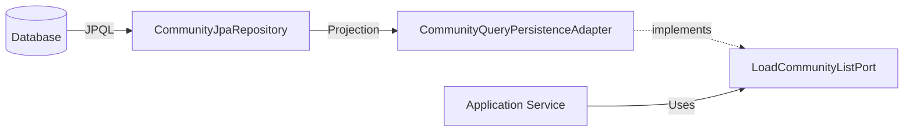

# Read-Model Implementation (A-Pattern)

This document explains the "Infra Projection → Adapter → Application DTO" pattern implemented for the Community List feature.

## Goal
To load a paged list of communities with author summaries and comment counts efficiently, without loading full entities or performing N+1 queries.

## Data Flow

1. **Database Layer**
   - We query `community`, `account`, and `comment` tables.
   - Using a single JPQL query with a `JOIN` and a correlated subquery for `count`.

2. **Infra Layer (Projection)**
   - **File**: `infra/community/repository/projection/CommunitySummaryProjection.java`
   - **Role**: Defines the shape of the data returned by the DB query. It is a flat interface (Spring Data Projection).
   - **Repository Query**:
     ```java
     @Query("SELECT c.id as communityId, ... FROM CommunityJpaEntity c ...")
     Page<CommunitySummaryProjection> findProjectedSummaries(Pageable pageable);
     ```

3. **Infra Layer (Adapter)**
   - **File**: `infra/community/adapter/CommunityQueryPersistenceAdapter.java`
   - **Role**:
     - Calls the repository to get `Page<CommunitySummaryProjection>`.
     - Maps the flat projection to the rich Application DTO structure.
     - Implements `LoadCommunityListPort`.
   - **Benefit**: Keeps infrastructure details (Projections, JPA Entities) hidden from the Application layer.

4. **Application Layer (DTO)**
   - **Files**: `application/community/dto/CommunitySummaryDto.java`, `AuthorSummaryDto.java`
   - **Role**: Defines the data contract required by the use case / presentation layer.
   - **Independence**: These DTOs have NO dependency on JPA, Hibernate, or Database structures.

## Diagram



## Pagination Stability
To ensure deterministic pagination results even when the caller does not provide a sort order, the Adapter layer implements a "Defensive Sort" strategy:
- It checks if `Pageable.getSort().isUnsorted()`.
- If true, it applies a default sort: `ORDER BY createdAt DESC, communityId DESC`.
- This approach guarantees stability while preserving the flexibility to support dynamic sorting (e.g., by view count) if requested by the client.

## files
- `infra/community/repository/projection/CommunitySummaryProjection.java`
- `infra/community/repository/CommunityJpaRepository.java` (Updated)
- `application/community/dto/CommunitySummaryDto.java`
- `application/community/dto/AuthorSummaryDto.java`
- `application/community/port/out/LoadCommunityListPort.java`
- `infra/community/adapter/CommunityQueryPersistenceAdapter.java`
